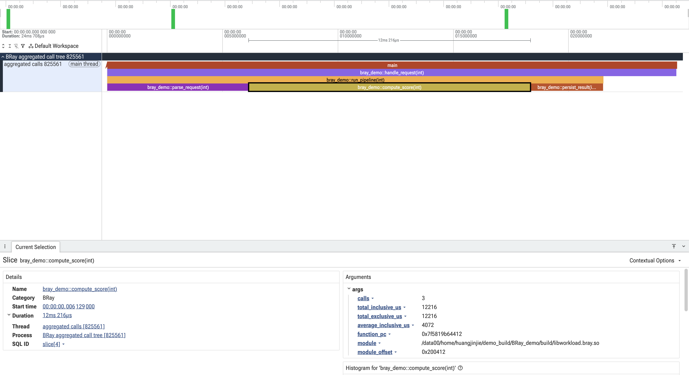

# BRay Demo

This demo builds a small executable and shared library, instruments function
entries and exits with BOLT, and writes a nested Chrome Trace containing each
function's inclusive and exclusive time.

## Quick Start

```sh
./run.sh
```

All generated LLVM files live under one top-level directory:

```text
llvm-build/
  llvm-project/ # shallow checkout of bolt_BRay
  build/        # CMake/Ninja output
```

`bootstrap.sh` shallow-clones
`https://github.com/Jinjie-Huang/llvm-project.git` branch `bolt_BRay`, or
fetches that branch's latest commit when the checkout already exists. It
rebuilds BOLT when the source revision changes. The script automatically
looks for existing tools like `clang` and `llvm-symbolizer` in your environment
to use directly; if missing, it builds them alongside BOLT.

To reuse an existing build:

```sh
BRAY_LLVM_BUILD_DIR=/path/to/llvm-build ./run.sh
```

## What It Demonstrates

The instrumented call tree is:

```text
main
  bray_demo::handle_request
    bray_demo::run_pipeline
      bray_demo::parse_request
      bray_demo::compute_score
      bray_demo::persist_result
```

The Hook library implements:

```cpp
extern "C" void __bolt_probe_enter(uint64_t function_pc);
extern "C" void __bolt_probe_exit(uint64_t function_pc);
```

`runtime/bray_trace.cpp` is one reference implementation of these Hooks. It
uses `__bolt_probe_enter` and `__bolt_probe_exit` to reconstruct function call
relationships and measure inclusive and self time for each call path. At
process exit, it writes every dynamic invocation and its module mapping to
`build/bray-trace.raw.json`.

Each thread maintains a stack of active calls. Entry pushes only the function
PC and timestamp; exit pops the frame, computes inclusive time, and subtracts
child time to get exclusive time. No symbol lookup or demangling runs in the
Hook path.

`runtime/symbolize_trace.py` reads the raw JSON, resolves each unique PC once
with `llvm-symbolizer`, aggregates repeated invocations by call path, prints
the terminal call tree, and writes `build/bray-trace.json`, which can be loaded
in `chrome://tracing` or <https://ui.perfetto.dev>. Chrome Trace and the
terminal both show one flame-graph-style node per call path, including total
inclusive time, self time, average time, and call count.

A sample output is available at
[`examples/bray-trace.json`](examples/bray-trace.json) and can be loaded
directly into the trace viewer.

### Perfetto Preview

The following screenshot shows the sample JSON loaded in
[Perfetto](https://ui.perfetto.dev):

> [](examples/bray-trace.png)

Terminal Output Example:

```text
[BRay] aggregated call tree (total inclusive / self, average inclusive, calls):
[BRay] main 24.723 ms / 0.025 ms, avg 24.723 ms, calls=1
[BRay]   bray_demo::handle_request(int) 24.697 ms / 3.143 ms, avg 8.232 ms, calls=3
[BRay]     bray_demo::run_pipeline(int) 21.554 ms / 0.012 ms, avg 7.185 ms, calls=3
[BRay]       bray_demo::parse_request(int) 6.168 ms / 6.168 ms, avg 2.056 ms, calls=3
[BRay]       bray_demo::compute_score(int) 12.216 ms / 12.216 ms, avg 4.072 ms, calls=3
[BRay]       bray_demo::persist_result(int) 3.159 ms / 3.159 ms, avg 1.053 ms, calls=3
```

## Files

- `run.sh`: builds, instruments, and runs the demo.
- `bootstrap.sh`: initializes and builds the LLVM/BOLT toolchain.
- `src/main.cpp`: executable entry point.
- `src/workload.cpp`: nested workload compiled as `libworkload.so`.
- `runtime/bray_trace.cpp`: reference Hook implementation for tracing function
  calls and timing through `__bolt_probe_enter` and `__bolt_probe_exit`; writes
  the intermediate `bray-trace.raw.json`.
- `runtime/symbolize_trace.py`: processes `bray-trace.raw.json`, performs
  batched offline symbolization and call-path aggregation, and writes the
  terminal call tree and Chrome Trace JSON.
